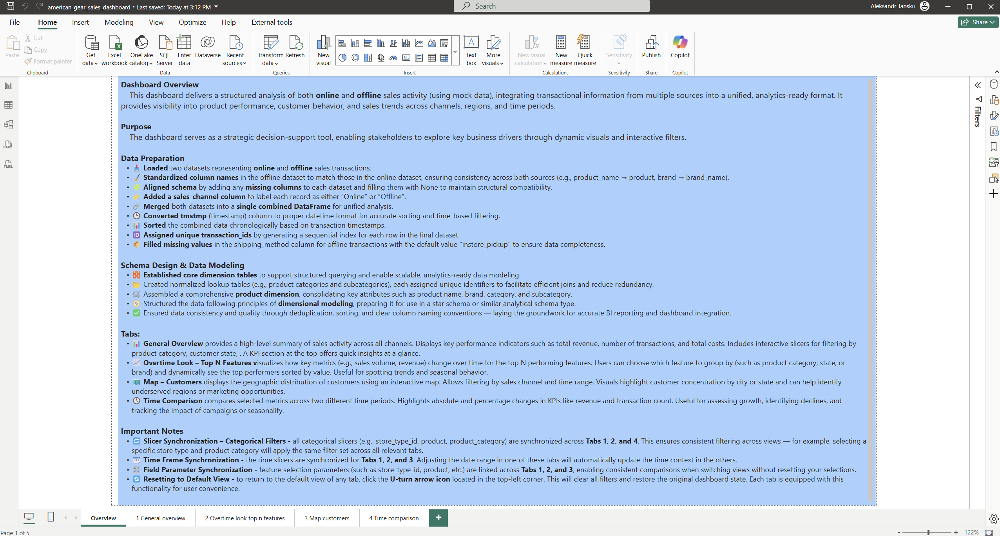

# 🏗️ American Gear Sales Data Pipeline Dashboard

> Full-stack data engineering project with real-time simulation, MinIO object storage, PostgreSQL warehouse, and Power BI dashboarding.

🔗 GitHub Repo: [ATanskiy/american_gear_sales_data_pipeline_dashboard](https://github.com/ATanskiy/american_gear_sales_data_pipeline_dashboard)

---

## 📦 Overview

This project simulates and processes online + offline sales data for a fictional American sports gear store. It includes:

- 🗃 Real-time daily file extraction from raw to unprocessed S3 (MinIO)
- ⚙️ ETL pipeline with deduplication and upsert logic
- 🧱 PostgreSQL warehouse with fact/dimension star schema
- 📊 Power BI dashboard (multi-tab, with KPIs, trends, and maps)

---

## 📁 Project Structure

```
american_gear_sales_data_pipeline_dashboard/
│
├── etl/                         # Transformation and upsert scripts
├── db/                          # DDL files and connection logic
├── scripts/                     # Raw-to-unprocessed S3 logic
├── scripts_drop_trancate_clean/ # Cleanup and maintenance scripts
├── dashboard/                   # Power BI visuals and links
├── seeds/                       # Dimension table CSV seeds
├── notebooks/                   # EDA and prototyping
├── config.py                    # Central config for env vars and settings
├── docker-compose.yaml          # Postgres and MinIO containers
└── run_main.py / run_etl.py     # Automation entry points
```

---

## ⚙️ How to Run

1. **Clone the repo**
   ```bash
   git clone https://github.com/ATanskiy/american_gear_sales_data_pipeline_dashboard.git
   cd american_gear_sales_data_pipeline_dashboard
   ```

2. **Create virtual environment**
   ```bash
   python -m venv .venv
   .venv\Scripts\activate  # Windows
   source .venv/bin/activate  # Linux/macOS
   ```

3. **Install dependencies**
   ```bash
   pip install -r requirements.txt
   ```

4. **Start infrastructure**
   ```bash
   docker-compose up -d
   ```

5. **Run full ETL + real-time simulation**
   ```bash
   python run_main.py  # Initial setup
   python run_etl_loop.py  # Infinite ETL loop with time.sleep
   ```

---

## 📈 Outcome

The final dashboard enables business users to:
- Track performance across sales channels
- Analyze customer and product trends
- Compare KPIs over time
- Drill down into geography-based insights

---

## 📊 Dashboard

Power BI dashboard is in `/dashboard` and includes:

- KPIs for revenue, costs, and units
- Time-series comparison for top features
- Customer distribution by state/city
- Store-level analysis

---

## 📷 Dashboard Previews

Below are preview images of the Power BI dashboard tabs included in this project:

### 🧭 Dashboard Introduction
  
*A quick overview of the dashboard purpose, data preparation steps, schema design, and navigation tips across tabs.*

### 📌 General Overview Tab
  
*Shows aggregated sales performance, revenue, costs, customers, and transactions with key slicers for filtering across time, product, store, and channel dimensions.*

### 📈 Overtime Look – Top N Features
  
*Presents line charts of revenue and costs over time, split by payment methods. Useful for trend analysis and comparing top-performing segments.*

### 🗺️ Map – Customers
  
*Displays geographic distribution of customers across states and cities. Enables identifying regional opportunities or performance gaps.*

### ⏳ Time Comparison Tab
  
*Enables side-by-side comparison of key metrics (e.g., revenue, costs, transactions) between two custom date ranges. Great for evaluating campaign impact or seasonality.*

---

## 💬 Notes

- Uses MinIO locally to simulate S3 buckets (`raw`, `unprocessed`, `processed`)
- Upsert logic uses `(customer_id, tmstmp)` to avoid duplicates
- Uses `RETURNING xmax = 0` to detect inserts vs updates in PostgreSQL

---

## 📬

Made with ❤️ by [@ATanskiy](https://github.com/ATanskiy)
---